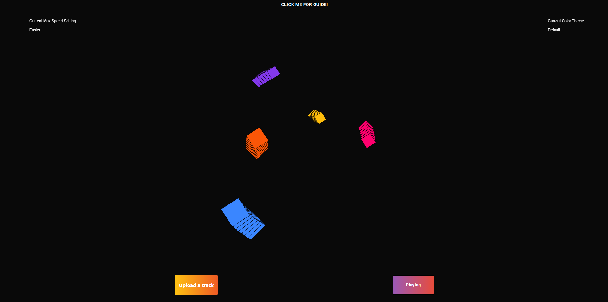

# Viz
An intereactive 3D audio visualizer for users to enjoy their favorite songs!

**Link to project:** https://viz.onrender.com

## How It's Made:

**Tech used:** React, Node, Express, P5.js, P5.sound.js

The design and functionality of the visualizer was built with P5.js. P5.js is a javascript library that is primarily used for coding creative designs. Think about it as if you are drawing with code.
The reason why I picked this language to build the visualizer was because within P5 is a library called P5.sound, which is what I used to keep track of frequencies in my sketch.

All of this happens inside a function called draw which can be found on line 68. Draw is a function that is passed to the sketch component that acts as a never ending loop, which is why we are able to constantly draw diamonds with different sizes, colors, and speeds.

To get the 5 diamonds I started off with a loop where the current index of the loop is a diamond I wanted to create. In order, the 5 diamonds represent treble, lowmid, mid, highMid, and bass frequencies. If the index is 0, it's treble. In the loop, I have a current variable that is used to get corresponding index values from other arrays.

All arrays in this project have a length of 5, each one represents settings for the diamonds. For example, on line 27 you will see an array of rotations for the diamonds each one representing the current direction a diamond is supposed to move in. If the index has a value of 1, the diamond that corresponds to it will rotate towards the right. If it's -1, it will rotate to the left. Since we know that anything at the 0 index is now related to the treble diamond and it has a value of -1, when the animation starts the treble diamond will move to the left.

I even had to learn some trigonometry in order to place a diamond where I needed it to be. It's a bit complicated but I will try my best to explain.

As of line 159, we know two things. The radius each diamond will use, which is how far something is from its point of origin, (in our case the center of the sketch) and the angle each diamond will use. This is known as a polar coordinate. My goal was to convert the polar coordinate to be a cartesian coordinate so we can set it as the new point of origin to be drawn at later.

In order to convert a polar coordinate to be a cartesian coordinate I had to find position on the x and y axis. The formula for this in trigonometry  X = radius * cosine(angle)  and Y = radius * sin (angle). 

To get the 3D look of the visualizer, I implemented another loop inside of the current loop that will create a diamond with the same properties only 2 radians apart from each other. To create the diamonds in the sketch, I made a class that takes 5 parameters in its constructor, the position it would be placed on the x-axis, the position it would
be placed on the y-axis, the angle it will be rotated at from the current angle, the current size its supposed to be based on the frequency it correlates to, and its color based on what the current color theme is. I then gave the class a method that when called will create the diamond with the parameters that was passed to that instance’s constructor.

Lastly, we update the angle each diamond based on the way they are rotating. Remember the directions array I mentioned earlier? If the corresponding current index in the directions array has a value of 1, increase the current angle by the speed of that frequency in radians.

Ex: A song is playing, inside the loop we are at index 4, So we know we are about to create our bass diamonds. We create a new diamond instance with our x and y positions, index 4 from the sizes array based on how loud the bass frequency is, and index 4 from the current color themes array. Then call its draw diamond method.

Now that we break out of the loops, we get the bass angle from the angles array at index 4, Since it has a value of -1, it will be moving to the left. We convert the current speed of the bass frequency to radians, make it a negative number and add it to the current angle so that the next time the loop goes through, it's moving!

## Lessons Learned:
• Stepping out of my comfort zone to learn trigonmetry in order to get the rotations to work showed me that I can do anything I put my mind into.

• Frameworks are nice, but they are not always needed. Looking at this, creating this could've been simpler without using React.

• Good documentation makes coding much easier. 

• Class instances are so dang helpful!

